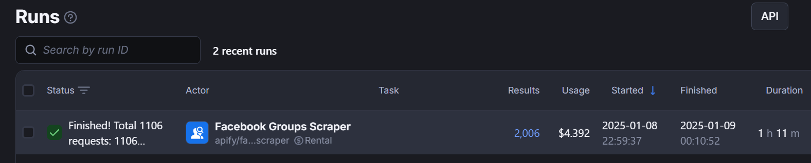

## README
To do - update README
read in secrets from toml (done)
import via from st.to.. etc to read in secrets (done)
commit files
check supabase is working 
might need to redeploy projct.

### Pipeline Overview

There are several parts to creating the supabase index.
1. use appify - scrape FB groups - up to 500
-- # apify/facebook-groups-scraper
2. use url_extraction.py to extract urls from JSON downloaded from appify (.json)
-- # input.json was output from appify 
-- # output of this file is external_links.md and facebook_links.md
3. The external files are in external_links.md
4. extract_url_from_md.py: Extract the urls from external_files.md
-- # output is urls.txt

## Run Pipeline

### Activate venv in Linux 

### Aciviating venv in Windows
cmd /k "activate"
To activate the venv1 cd venv1/scripts, the above
https://stackoverflow.com/questions/22288569/how-do-i-activate-a-virtualenv-inside-pycharms-terminal

### Pre-install Crawl4ai the package 
See crawl4ai github page

### Install the package
python -m venv venv
source venv/bin/activate  # On Windows: venv\Scripts\activate
pip install -r requirements.txt

### Set up environment variables 
OPENAI_API_KEY=your_openai_api_key
SUPABASE_URL=your_supabase_url
SUPABASE_SERVICE_KEY=your_supabase_service_key
LLM_MODEL=gpt-4o-mini  # or your preferred OpenAI model

### Create index
crawl to create your index

### Run 
streamlit run streamlit_ui.py